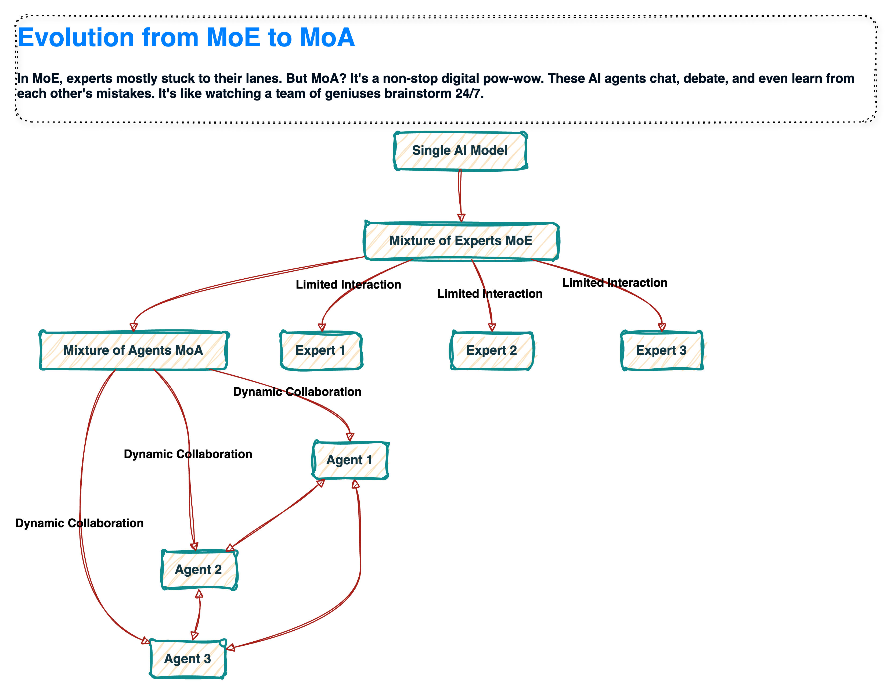
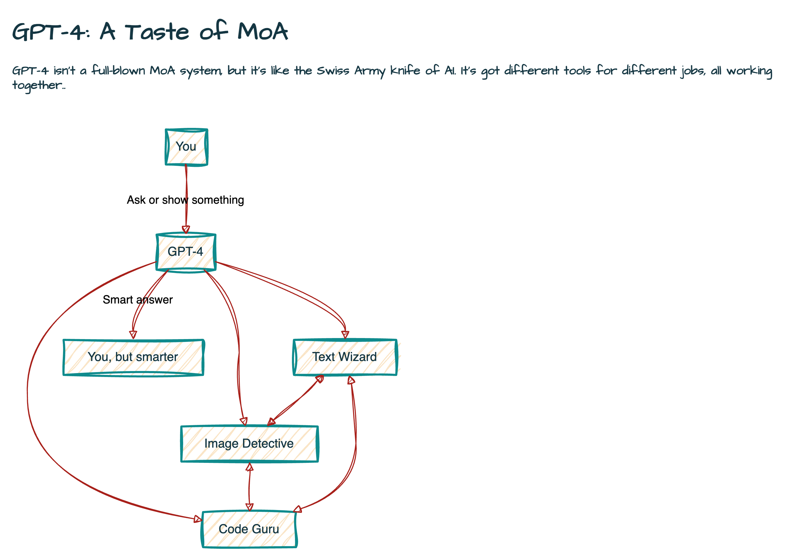
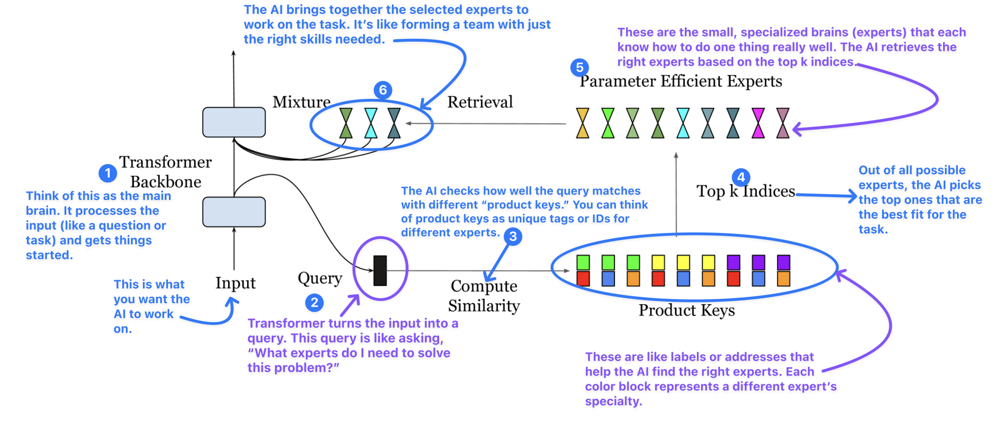
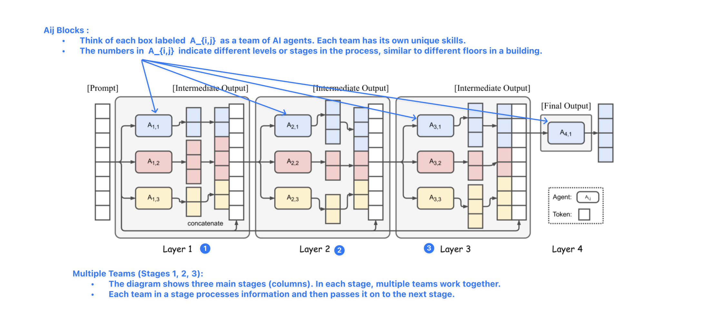
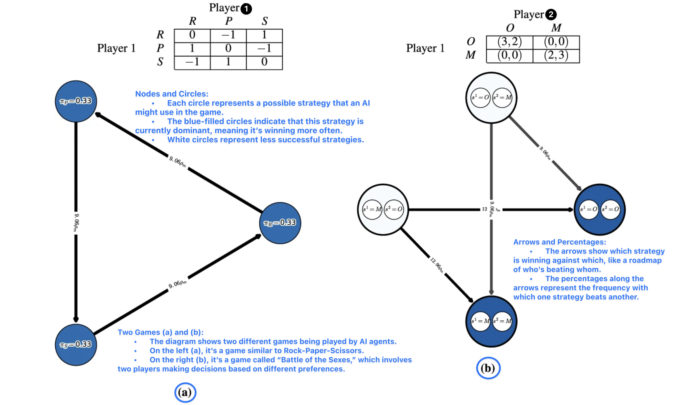
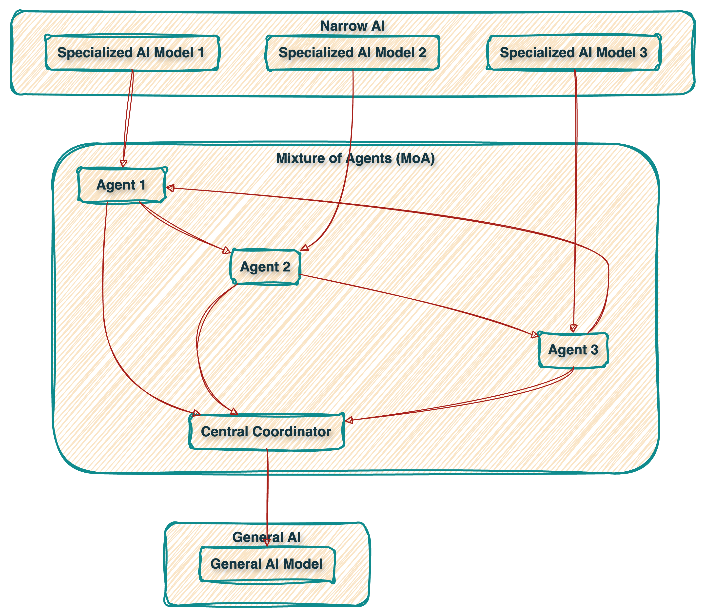
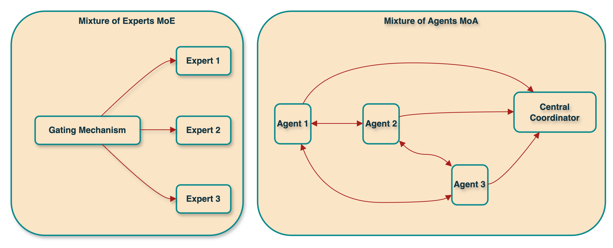

\makekanakacover
\makecustomtitlepage
\tableofcontents
\newpage

# Mixture of Agents (MoA)

## Introduction

Imagine a world where artificial intelligence doesn't just compute – it collaborates. Welcome to the revolutionary realm of Mixture of Agents (MoA), a paradigm shift that's redefining the boundaries of AI capabilities. In an era where single-model AI systems are reaching their limits, MoA emerges as a beacon of innovation, promising to unlock new frontiers in problem-solving and decision-making.

But what exactly is MoA, and why should it capture the attention of AI enthusiasts and researchers alike? At its core, MoA takes the concept of Mixture of Experts (MoE) to new heights, creating a symphony of specialized AI agents that work in harmony to tackle challenges too complex for any single model. Picture a team of elite specialists, each bringing unique skills to the table, dynamically collaborating to produce solutions greater than the sum of their parts.

The AI landscape has witnessed remarkable milestones – from AlphaGo's strategic mastery to GPT-3's linguistic prowess. Yet, as we venture into uncharted territories of AI application, the limitations of monolithic architectures become increasingly apparent. MoA addresses this by fostering an ecosystem of diverse AI agents, each contributing its expertise to a collective intelligence that's more adaptable, scalable, and capable than ever before.

In this article, we'll embark on an exciting journey through the world of Mixture of Agents:

1. We'll trace the evolutionary path from MoE to MoA, understanding the key innovations that define this new paradigm.
2. We'll explore cutting-edge research, examining how MoA is pushing the boundaries of AI performance across various domains.
3. We'll compare MoA with traditional approaches, highlighting its unique advantages and potential challenges.
4. We'll investigate real-world applications, from enhancing language models to revolutionizing complex decision-making processes.
5. Finally, we'll peer into the future, considering the profound implications MoA holds for the trajectory of AI development and its potential to reshape industries.

Join us as we unravel the intricacies of Mixture of Agents – a technology poised to redefine collaboration in the digital age and unlock new realms of artificial intelligence. Whether you're an AI researcher, a tech enthusiast, or simply curious about the future of intelligent systems, this exploration of MoA promises to expand your understanding of what's possible when machines learn to work together in unprecedented ways.
\newpage

## From MoE to MoA (Mixture of Experts to Mixture of Agents)

Remember when a computer beating a chess champ was headline news? Those days are ancient history. We've zoomed from solo AI performers to full-blown digital orchestras. Welcome to the age of Mixture of Agents (MoA) – where AI teamwork makes the dream work.

Let's break it down:

1. Single-model AI: The one-hit wonders. Great at chess, not so hot at everything else.
2. Mixture of Experts (MoE): The specialist squad. Got a problem? There's an expert for that.
3. Mixture of Agents (MoA): The AI dream team. Versatile, collaborative, and ready for anything.

Why the upgrade? Because life's messy, and solo AIs were dropping the ball. MoA said, "Let's bring in the whole crew and jam together."

Check out this cool diagram to see how we got here:

\newpage

## Examples of MoA

In MoE, experts mostly stayed in their lanes. MoA? It's a 24/7 brainiac party. These AI agents chat, debate, and even learn from each other's goof-ups. It's like watching a team of geniuses brainstorm non-stop.
Want a taste of MoA in action? Look no further than **Google's PaLM-E**. This cutting-edge system combines language models with robotic control. Imagine an AI that can not only understand your request to "grab the red ball," but also figure out how to physically do it. That's the power of multiple AI agents working together – one handles language, another tackles visual recognition, and a third plans the robot's movements.
Or consider **OpenAI's GPT-4**, which can juggle text, images, and code. While not a full-blown MoA, it shows how multiple AI models can team up in one system. It's like having a writer, artist, and programmer all in one digital brain.
The bottom line? MoA is changing the game. It's not just about making AI smarter – it's about making AI work together in ways we never imagined. Get ready for a world where AI doesn't just compute, it collaborates.

## GPT-4: A Step Towards MoA

Ever wished for a super-smart buddy who could write your essays, explain memes, and debug your code? Meet GPT-4, the AI that's doing just that - and showing us a glimpse of the Mixture of Agents (MoA) future!
GPT-4 isn't a full-blown MoA system, but it's like the Swiss Army knife of AI. It's got different tools for different jobs, all working together.

Let's peek under the hood:

\newpage

Here's the magic: These different "experts" in GPT-4 don't just work alone. They're like a team of brainiacs, always chatting and sharing notes. For example:

You show GPT-4 a pic of your overflowing closet.
The Image Detective figures out it's looking at a messy wardrobe.
It passes this info to the Text Wizard.
Boom! GPT-4 not only describes your closet chaos but also writes you a step-by-step decluttering guide.

It's not quite like having separate AI agents, but it's getting there. Each part of GPT-4 is a star player, and together, they're unstoppable.
Want to see how smart this team is? Check this out:

It can help your kid with math homework, explaining steps like a patient tutor.
Show it a meme, and it'll explain the joke (even if it's not that funny).
It can turn your app idea into actual working code. It's like having a programmer in your pocket!

Here's the kicker: GPT-4 is just the opening act. Imagine when we have real AI agents, each a genius in its own right, teaming up to solve problems. That's the MoA future we're heading towards.
So next time you're chatting with GPT-4, remember: you're not just talking to an AI. You're getting a sneak peek at the future of artificial intelligence - a future where AI teamwork makes the dream work!
\newpage

## Mixture of Agents: When AIs Join Forces

Remember when the Avengers first assembled, and suddenly solo superheroes seemed so... last season? That's what's happening in AI right now with Mixture of Agents (MoA). It's not just a new trick – it's a whole new game. Let's dive into the research that's making waves:

### 1. The Million-Expert Mic Drop: PEER Power

Xu Owen He's "Mixture of A Million Experts" paper didn't just raise the bar – it launched it into orbit. Here's the scoop:

- Star of the Show: PEER (Parameter Efficient Expert Retrieval)
- What It Does: Imagine having a million tiny AI experts, each a whiz at something specific.
- Why It's Cool: It beats big, solo AI models while sipping, not guzzling, computational power.

How it works: PEER uses a "product key" method to speed-dial the right mini-experts for each job. It's like having the world's biggest, smartest contact list.

Comparison: Traditional models are like one big brain trying to do everything. PEER is like a million specialized brains working together. It's the difference between a Swiss Army knife and an entire workshop.

This figure illustrates the structure of the Parameter Efficient Expert Retrieval (PEER) layer, including the query network, product keys, and expert networks. Reference: He, X. O. (2024). Mixture of A Million Experts. arXiv preprint arXiv:2407.04153v1

#### Understanding the Diagram: PEER (Parameter Efficient Expert Retrieval)

1. **Transformer Backbone:**

   - Think of this as the main brain. It processes the input (like a question or task) and gets things started.

2. **Input:**

   - This is what you want the AI to work on. It could be anything, like a piece of text or a problem to solve.

3. **Query:**

   - The main brain (Transformer Backbone) turns the input into a query. This query is like asking, "What experts do I need to solve this problem?"

4. **Compute Similarity:**

   - The AI checks how well the query matches with different "product keys." You can think of product keys as unique tags or IDs for different experts.

5. **Product Keys:**

   - These are like labels or addresses that help the AI find the right experts. Each color block represents a different expert’s specialty.

6. **Top k Indices:**

   - Out of all possible experts, the AI picks the top ones that are the best fit for the task. This is what "Top k Indices" means – choosing the best matches.

7. **Parameter Efficient Experts:**

   - These are the small, specialized brains (experts) that each know how to do one thing really well. The AI retrieves the right experts based on the top k indices.

8. **Retrieval and Mixture:**
   - The AI brings together the selected experts to work on the task. It’s like forming a team with just the right skills needed.
     \newpage

### 2. Language Models: The Ultimate Tag Team

Junlin Wang and crew's "Mixture-of-Agents Enhances Large Language Model Capabilities" took MoA out for a spin in the language world:

- The Setup: Picture a skyscraper where each floor is a team of AI agents, chatting up and down the elevator.
- The Result: This AI collab actually outperformed GPT-4 on some tricky language tasks. Yes, you read that right!
- The Secret Sauce: Diversity. They mixed different flavors of AI models, each bringing its own special zest.

Key Discovery: AIs can be "collaborative learners" – they often level up when they can peek at other AIs' work!

Real-world Impact: This could revolutionize everything from customer service chatbots to AI writing assistants. Imagine a chatbot that can switch between being a poet, a technician, and a comedian, all in one conversation!

This figure shows the multi-layer structure of the MoA model, with different agents in each layer and how they interact. Reference: Wang, J., et al. (2024). Mixture-of-Agents Enhances Large Language Model Capabilities. arXiv preprint arXiv:2406.04692v1.

#### Understanding the Diagram: Mixture-of-Agents in Language Models

1. **The Grid Layout (Aij Blocks):**

   - Think of each box labeled \( A\_{i,j} \) as a team of AI agents. Each team has its own unique skills.
   - The numbers in \( A\_{i,j} \) indicate different levels or stages in the process, similar to different floors in a building.

2. **Multiple Teams (Stages 1, 2, 3):**

   - The diagram shows three main stages (columns). In each stage, multiple teams work together.
   - Each team in a stage processes information and then passes it on to the next stage.

3. **Passing Information:**

   - The arrows between teams (and stages) represent the flow of information.
   - It's like these teams are talking to each other, sharing what they've learned before moving to the next stage.

4. **Concatenation:**

   - After each stage, the results from different teams are combined (concatenated). This means that all the knowledge from those teams is pulled together into one big chunk.

5. **Final Output:**

   - After passing through all stages, the final output is produced. This output is the result of all the teams working together.
   - Think of this as the ultimate answer or response generated by the AI, informed by all the different perspectives from each team.

6. **Collaboration Across Stages:**
   - The small block in the bottom right represents how each team collaborates with others in its stage and across stages, ensuring that the final answer is well-rounded and complete.
     \newpage

### 3. AI Gladiator Arena: Alpha-Rank

Shayegan Omidshafiei's team introduced "Alpha-Rank: Multi-Agent Evaluation by Evolution", turning AI evaluation into a high-tech Hunger Games:

- The Method: Uses evolutionary game theory – imagine AI strategies battling it out over eons, but super fast.
- The Flex: Can handle games more complex than a 4D chess tournament.
- The Insight: Shows not just the champion, but the whole ecosystem of AI strategies.

Cool Factor: Alpha-Rank can spot strategy cycles – like finding out rock-paper-scissors situations between AIs!

Why It Matters: In the real world, it's not always about being the best, but about being the best in a specific context. Alpha-Rank helps us understand these nuances.

This figure demonstrates how Alpha-Rank evaluates strategies in games like Rock-Paper-Scissors and Battle of the Sexes. Reference: Omidshafiei, S., et al. (2019). Alpha-Rank: Multi-Agent Evaluation by Evolution. Scientific Reports, 9(1), 9937.

#### Understanding the Diagram: Alpha-Rank in Action

1. **Two Games (a) and (b):**

   - The diagram shows two different games being played by AI agents.
   - On the left (a), it's a game similar to Rock-Paper-Scissors.
   - On the right (b), it’s a game called "Battle of the Sexes," which involves two players making decisions based on different preferences.

2. **Nodes and Circles:**

   - Each circle represents a possible strategy that an AI might use in the game.
   - The blue-filled circles indicate that this strategy is currently dominant, meaning it’s winning more often.
   - White circles represent less successful strategies.

3. **Arrows and Percentages:**

   - The arrows show which strategy is winning against which, like a roadmap of who’s beating whom.
   - The percentages along the arrows represent the frequency with which one strategy beats another.

4. **Strategy Dynamics (Left Game - Rock-Paper-Scissors):**

   - In the Rock-Paper-Scissors-like game (left side), each strategy (rock, paper, or scissors) can beat one and lose to another, creating a cycle.
   - Alpha-Rank captures this cycle by showing arrows pointing in a triangle, indicating the circular nature of winning and losing in this game.

5. **Strategy Dynamics (Right Game - Battle of the Sexes):**

   - In the "Battle of the Sexes" game (right side), the strategies are more about coordination and less about direct competition.
   - The arrows and colors show which strategies end up dominating based on how the two AI agents interact.

6. **Payoff Tables:**

   - The small tables at the top show the payoffs (or rewards) for each strategy combination.
   - These tables help explain why certain strategies become dominant: they simply provide better rewards in certain situations.

7. **Evolutionary Insight:**
   - Alpha-Rank doesn’t just tell you which strategy is the best; it shows how strategies evolve over time, revealing the rich dynamics of AI competition.
   - It’s like watching an AI strategy tournament unfold and seeing who wins, who loses, and who makes a comeback.
     \newpage

### 4. MoA Breaks Out of the Lab

MoA isn't just fancy theory – it's starting to flex in the real world:

- Google's PaLM-E: Combines chatbot smarts with robot moves. It's like if Siri could suddenly make you a sandwich.
- OpenAI's GPT-4: While not pure MoA, it shows how mixing text, image, and coding skills can create an AI Swiss Army knife.

The Big Picture: MoA is bridging the gap between narrow AI (one-trick ponies) and general AI (Renaissance polymaths).

This figure demonstrates the connections between Narrow AI, MoA, and General AI, as represented in the diagram

#### Transition from Narrow AI to General AI via Mixture of Agents (MoA)

1. **Narrow AI (Specialized Models):**

   - **What It Is:** Narrow AI consists of specialized models designed to perform one specific task extremely well, such as recognizing images, translating languages, or playing chess.
   - **Example:** A facial recognition model that is exceptionally good at identifying faces but can't perform any other tasks.
   - **Limitation:** Each model is limited to its specific task and cannot adapt to other tasks or domains.

2. **Mixture of Agents (MoA):**

   - **What It Is:** MoA serves as a bridge between narrow AI and more versatile systems. Instead of relying on a single model, MoA leverages multiple specialized agents that collaborate to solve complex problems. Each agent in the mixture excels at a specific sub-task, but they work together to handle broader, more complex challenges.
   - **Example:** In MoA, one agent might excel at processing text, another at analyzing images, and a third at coding. Together, they can work on tasks that require multiple types of expertise.
   - **Why It Matters:** MoA improves the adaptability and versatility of AI by combining the strengths of specialized agents. The central coordinator manages their interactions, ensuring that the best agent for a given task is utilized. This approach begins to address tasks that are beyond the capabilities of individual narrow AI models.

3. **General AI (Versatile, Multifunctional Model):**
   - **What It Is:** General AI represents the ultimate goal of creating a single AI model capable of performing a wide range of tasks across different domains. It is not limited to one specific task but can adapt and learn new tasks as needed.
   - **Example:** A General AI model could write a poem, code a program, diagnose a disease, and even play chess—all within a single system.
   - **Advantages:** General AI provides unparalleled versatility, adaptability, and efficiency. It eliminates the need for multiple specialized models and the complexity of coordinating them, offering a more holistic and unified approach to solving diverse problems.

### The Evolution and Its Advantages

- **From Narrow AI to General AI:** The transition from Narrow AI to General AI via MoA reflects the evolution of AI technology towards greater adaptability and versatility. Narrow AI serves as the foundation, excelling at specific tasks, while MoA introduces the concept of collaboration among specialized agents to tackle more complex problems. Ultimately, General AI aspires to combine the strengths of all these approaches into a single, powerful system.

- **End Product and Advantage:** The end product is a General AI system that can handle multiple tasks across various domains without needing to switch between different models. This approach is advantageous because it reduces the need for domain-specific training, allows for more efficient resource use, and offers a unified AI solution capable of continuous learning and adaptation.
  \newpage

### What's Next in the MoA Cookbook?

1. AI Diversity on Steroids: Expect teams of AI agents with skills as varied as a circus troupe.
2. Explainable Teamwork: AIs that can break down their collaboration. "I did the math, she wrote the poem, and he checked our grammar."
3. Dynamic Team-Building: AIs that can headhunt and onboard new team members on the fly, based on what the task needs.

Challenges Ahead:

- Balancing Act: Managing communication between agents without drowning in data.
- Ethical Teamwork: Ensuring AI collabs don't amplify biases or make unethical decisions.
- Computational Hunger: These AI teams can be resource-hungry beasts. Making them leaner and greener is key.

The Bottom Line: MoA isn't just changing the AI game – it's creating a whole new playing field. We're moving from solo AI virtuosos to AI orchestras, and the symphony is just beginning. Stay tuned, because this is where AI gets its team spirit on!
\newpage

## MoA vs. MoE: The AI Collaboration Revolution

Remember when "teamwork" in AI meant a bunch of specialists waiting for their turn? That's so last year. Welcome to the world of Mixture of Agents (MoA), where AI collaboration gets a major upgrade. Let's break down this evolution from Mixture of Experts (MoE) to MoA, and see how it's reshaping the AI landscape.

### The Teamwork Spectrum: MoE to MoA

Mixture of Experts (MoE): The Specialist Squad

- Think of it as a panel of experts, each a guru in their field
- A smart receptionist (the gating network) directs questions to the right expert
- Experts rarely chat with each other - they stay in their lanes
- Perfect for clear-cut, domain-specific problems

Mixture of Agents (MoA): The AI Think Tank

- Imagine a group of versatile problem-solvers in a constant brainstorm session
- Agents share insights, build on each other's ideas, and tackle problems together
- The whole team adapts and learns, becoming more than the sum of its parts
- Excels at complex, nuanced challenges that require multiple perspectives

Let's break it down further:

| Aspect        | MoE                        | MoA                               |
| ------------- | -------------------------- | --------------------------------- |
| Flexibility   | Rigid, specialized roles   | Adaptable, multi-skilled agents   |
| Collaboration | Minimal inter-expert comms | Active info sharing and teamwork  |
| Scalability   | Limited by expert count    | Scales to highly complex problems |
| Learning      | Experts train separately   | Agents can learn from each other  |
| Output        | Best expert's answer       | Synthesized team response         |

#### MoE vs MoA Explanation:

- **Mixture of Experts (MoE):**
  - **Structure:** Shows a central **Gating Mechanism** that is responsible for selecting which **Expert** (1, 2, or 3) will be used for a given task.
  - **Flow:** The communication is unidirectional from the gating mechanism to the experts. The experts do not communicate with each other; they only interact with the gating mechanism.
- **Mixture of Agents (MoA):**
  - **Structure:** Depicts multiple **Agents** (1, 2, 3) that are interconnected, allowing bidirectional communication between them.
  - **Flow:** In MoA, the agents can communicate with each other, sharing information bidirectionally, and also interact with a **Central Coordinator** that helps manage the overall process.

### Key Differences:

- **Communication Flow:**

  - In **MoE**, experts are isolated and only interact through the gating mechanism. This setup works well for selecting the best expert for a specific task.
  - In **MoA**, agents are interconnected and can collaborate directly with each other, making the system more flexible and capable of handling more complex tasks that require combined expertise.

- **Coordination:**
  - **MoE** relies on a central gating mechanism to choose the best expert.
  - **MoA** uses a central coordinator to manage collaboration among the agents, ensuring that the most relevant agents work together on a task.

### The Tech Behind the Teamwork:

- MoE uses a gating mechanism, often a neural network, to select experts (as seen in "Outrageously Large Neural Networks: The Sparsely-Gated Mixture-of-Experts Layer" by Shazeer et al., 2017)
- MoA leverages advanced communication protocols, like attention mechanisms or graph neural networks, allowing for more complex information exchange (inspired by "Mixture-of-Agents Enhances Large Language Model Capabilities" by Wang et al., 2024)
- In MoA, we often see multi-step reasoning processes, where agents iteratively refine solutions (similar to the approach in "Alpha-Rank: Multi-Agent Evaluation by Evolution" by Omidshafiei et al., 2019)
  \newpage

## Real-World Applications: MoA in Action

1. Language Models That Get You:

   - Today: GPT-3 uses a basic form of MoE, with different experts for different types of knowledge
   - MoA Future: Imagine ChatGPT on steroids - one agent grasps context, another ensures factual accuracy, and a third crafts the perfect response tone
   - Real-world impact: An AI writer that can switch from technical documentation to creative storytelling, always striking the right tone and nailing the facts

2. Robots That Think on Their Feet:

   - Current MoE approach: Separate systems for vision, planning, and movement
   - MoA upgrade: A unified system where visual input instantly influences decision-making and motion
   - Example: Boston Dynamics' robots could evolve from impressive but pre-programmed movements to adaptive behaviors in unpredictable environments

3. Game AI That Plays and Learns Like a Pro:

   - Traditional: AIs like AlphaGo, specialized for a single game
   - MoA innovation: A system where strategy, tactics, and learning agents work in harmony
   - Application: An AI that could master chess, then quickly adapt its skills to excel at real-time strategy games

4. Scientific Discovery at Warp Speed:

   - Current: Separate tools for data analysis, hypothesis generation, and experiment design
   - MoA potential: A unified system where these aspects inform each other in real-time
   - Breakthrough example: In climate modeling, one agent could analyze historical data, another predict future trends, and a third design optimal mitigation strategies - all collaborating to tackle climate change

5. Education Tailored Just for You:
   - MoE approach: Different experts for different subjects and teaching methods
   - MoA evolution: A system where subject knowledge, teaching strategies, and student psychology agents collaborate
   - Real-world impact: An AI tutor that not only adjusts content difficulty but also picks up on your frustration and changes its teaching style on the fly
     \newpage

### Case Study: PaLM-E - A Glimpse of MoA in Action

Google's PaLM-E (Embodied Language Model) gives us a taste of MoA's potential. It combines:

1. A large language model for understanding and generating text
2. Visual processing capabilities for interpreting images and video
3. Robotic control modules for physical interaction

This allows PaLM-E to:

- Understand complex instructions involving visual and physical tasks
- Generate plans that combine language understanding with physical actions
- Learn and adapt to new scenarios by combining different types of knowledge

While not a full MoA system, PaLM-E shows how combining different AI capabilities can lead to more versatile and powerful systems.

### Implications for AI Development:

1. Architecture Revolution: We're moving from monolithic models to modular, interconnected systems
2. Communication is Key: Developing advanced inter-agent protocols becomes crucial
3. Balancing Act: Finding the sweet spot between specialist knowledge and generalist flexibility
4. Training Paradigm Shift: Moving from isolated pre-training to collaborative, task-specific fine-tuning

### Ethical Considerations and Challenges:

1. Black Box Dilemma: Ensuring transparency when multiple agents contribute to decisions
2. Bias Amplification: Managing how biases might compound through agent interactions
3. Privacy Concerns: Protecting data when it's shared across multiple agents
4. Resource Intensity: Addressing the potentially higher computational demands of MoA systems
5. Alignment Complexity: Ensuring all agents in the system are aligned with human values
   \newpage

## The Future of MoA: Where We're Headed

1. Self-Evolving AI Ecosystems: Systems that can add, remove, or modify agents based on new challenges
2. Human-AI Collaborative Networks: Seamless integration of human experts with AI agents
3. Meta-Learning Breakthroughs: MoA systems that can rapidly adapt to entirely new domains
4. Emergent Behaviors: Discovering novel solutions that arise from complex agent interactions
5. Towards Artificial General Intelligence (AGI): MoA as a potential stepping stone to more general AI capabilities

The Bottom Line:
MoA isn't just a technical upgrade - it's a whole new way of thinking about AI. We're moving from a world of AI specialists to AI collaborators, and the possibilities are mind-boggling. As we push further into this frontier, we're not just making smarter AIs; we're creating AI teams that think, learn, and innovate in ways we're only beginning to imagine. Buckle up, folks - the AI collaboration revolution is just getting started!

## Orchestrating the Future: The Mixture of Agents Symphony

From solo virtuosos to symphonic masterpieces, we've witnessed AI's evolution from narrow specialists to collaborative ensembles. As we lower the baton on our exploration of Mixture of Agents (MoA), let's recap our journey and look ahead to the next movements in this AI opus.

### Key Movements in Our MoA Odyssey:

1. From Soloists to Ensembles: The shift from Mixture of Experts (MoE) to MoA marks a transition from AI specialists to versatile collaborators.
2. The Power of AI Teamwork: MoA systems are conquering complex challenges that leave traditional AIs in awe.
3. Real-World Crescendos: From nuanced language models to scientific discovery accelerators, MoA is already rewriting the AI score.
4. Harmonizing the Discord: We've addressed the challenges of transparency, bias, and computational costs in these AI ensembles.

### Composing the Future:

1. Self-Conducting AI Orchestras: Envision AI systems auditioning and onboarding new "musicians" (agents) in real-time, adapting like a jazz band improvising.
2. Human-AI Duets: MoA could usher in an era of seamless collaboration between human experts and AI agents.
3. Emergent Symphonies: As our AI ensembles grow more intricate, we might witness the birth of entirely new problem-solving genres.
4. Ethical Compositions: Future MoA systems must be composed with notes of transparency, fairness, and harmony with human values.

### Spotlight on Cutting-Edge Research:

- Google's PaLM-E: A harmonious blend of language, vision, and robotic control, foreshadowing versatile AI assistants.
- DeepMind's Gato: A generalist virtuoso performing over 600 diverse tasks, showcasing multi-skilled AI potential.
- OpenAI's GPT-4: While not a full MoA system, it demonstrates how integrating multiple capabilities can lead to breakthrough performance.

### Your Ticket to the AI Philharmonic:

1. Deep Dive into the Score: Start with seminal papers like "Mixture of A Million Experts" and "Alpha-Rank: Multi-Agent Evaluation by Evolution".

2. Compose Your Own Melodies:

   - Developers: Implement a simple MoA system, perhaps combining a language model with an image recognition model for nuanced image captioning.
   - Researchers: Explore how MoA principles could accelerate progress in your field of study.

3. Join the Orchestra:

   - Engage in AI forums like /r/MachineLearning or the Hugging Face community.
   - Attend or organize meetups and workshops focused on collaborative AI.

4. Keep Your Ear to the Ground:

   - Follow leading AI labs and set up alerts for MoA-related terms to stay on the cutting edge.

5. Ponder the Encore:
   - Reflect on MoA's potential impact across various fields and consider the ethical implications of widespread adoption.

### Striking a Cautionary Note:

While the potential of MoA is exhilarating, we must also consider the potential risks:

- Increased system complexity could lead to unpredictable behaviors or harder-to-detect biases.
- The computational demands of MoA systems might exacerbate environmental concerns related to AI's energy consumption.
- As AI systems become more capable, we must vigilantly guard against misuse and ensure robust safety measures.

\newpage

## The Grand Finale: MoA's Impact on AI

Mixture of Agents isn't just another movement in the AI symphony – it's a fundamental reimagining of the entire orchestra. By enabling AI systems to collaborate, adapt, and tackle complex problems with unprecedented flexibility, MoA is pushing the boundaries of what's possible in artificial intelligence.

This shift towards collaborative AI has profound implications:

- It could accelerate breakthroughs across scientific disciplines, from drug discovery to climate modeling.
- In industry, it promises more adaptive and intelligent systems, potentially revolutionizing everything from manufacturing to customer service.
- For everyday users, it could mean AI assistants that truly understand and adapt to our needs, seamlessly integrating into our lives in helpful and meaningful ways.

Most importantly, MoA represents a step towards AI systems that can navigate the complexity and nuance of the real world – a crucial advancement on the path to artificial general intelligence.

The AI revolution isn't just about creating smarter machines – it's about fostering AI ensembles that can riff, improvise, and harmonize in ways we're only beginning to imagine. We're transitioning from a world of AI soloists to AI symphonies, and the concert is just beginning.

So, are you ready to take your seat in this grand AI orchestra? Whether you're a seasoned AI composer or a curious newcomer, there's a place for you in this exciting new world of collaborative AI. The baton is raised, the musicians are ready – let's make some beautiful, responsible, and groundbreaking AI music together!
